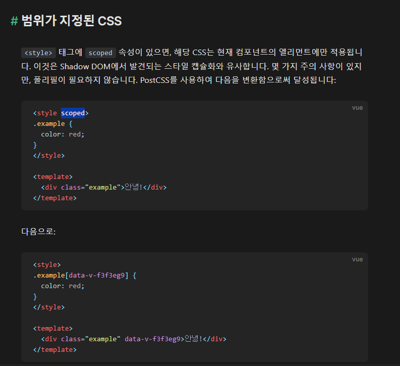

### vue3 문법에 대해 기록

#### 반응형 (ref)

ref, reactive 둘 다 반응형이며 깊은 참조다
(차이점은 ref - 모든 타입가능,  reactive - 객체만(obj, arr))

props같은거에서 부모 -> 자식에게 데이터를 내려줄때

>부모에서 데이터를 반응형으로 안 줘도 자식에서 반응형으로 받으면 부모랑 상관없이 >자식에선 반응형으로 받을 수 있는건가에 대한 답은

답 : 부모에서 반응형으로 줘야한다

이유 : 부모에선 `script` 부분에선 ref 즉 반응형으로 주지 않으면 해당 값을 변경시 데이터는 변경되었지만 template쪽에 변경값이 업데이트 되지 않는다 -> 이는 변경은 되었지만 반응형이 아닌거에 대해 보여지는건 아니란거다

즉 부모에서 반응형으로 줘야 해당 반응형값이 변경될때 `template`부분에 업데이트가 되면서 자식에게 전달되어 자식에서 받아서 자식쪽에서 반응형으로 받아 또 자식에서 반응형으로 할 수 있다

즉 각각 반응형으로 생성해야 해당 페이지에서 반응형으로 쓰는건 맞지만 부모에서 데이터를 줄려면 자식컴포넌트쪽 `template`쪽으로 주기떄문에 부모도 반응형으로 줘야 자식에서 받을 수 있단거다

정리 - 반응형으로 쓰는건 부모, 자식 각각 페이지에서 반응형으로 받으면 해당 페이지에선 반응형으로 해당 데이터 사용 가능 
하지만 props같은 부모에서 자식에게 줄때 자식 컴포넌트에 데이터를 넘길려면 부모에서도 반응형으로 줘야 해당 데이터가 `template`에 반응형이 걸려 업데이트 된걸 자식에서 전달받아 자식도 그걸 반응형으로 받아 써야 해당 페이지에서도 반응형으로 사용이 가능하다


#### computed

```js
const count = ref(1)
const plusOne = computed({
  get: () => count.value + 1,
  set: (val) => {
    count.value = val - 1
  }
})

plusOne.value = 1
console.log(count.value) // 0

```
computed -> getter, setter 동작 방법은 

호출만 할 경우 -> getter 선언해서나, 선언없이 기본형태가 getter 읽기다
할당할 경우 -> setter를 computed에 선언해서 할당할 수 있다 

그런데 할당을 하면 getter, setter 둘 다 선언해서 setter할당된걸 getter에서 보여지는 순서인 줄 알았지만 호출 -> getter만, 할당 -> setter만 각각 호출하는거였다


### readonly

readonly() 로 감싼건 읽기모드로 변해서 재할당할때 못바꾸게 경고가 나온다 (경고가 나오는거지 값도 못바꾼다 - 읽기모드다)

### watch & watcheffect

watch - watch()는 기본적으로 개으릅니다(lazy). 그러므로 콜백은 감시된 소스가 변경되었을 때만 호출됩니다.(안에 적은거만 감시 -> 하나만 , 아니면 감시할걸 안 적고 두번쨰 콜백으로 첫번째 콜백에 적은 결과를 두번째로 넘겨서 해당 첫번쨰값을 두번째에서 감시해서 뱉기도 한다)

watch는 전과 후 값 모두 볼 수 있음 첫번째 두번째인자로

watcheffect - watch처럼 변경될때 감시해서 호출하지만 처음도 바로 호출한다 (안에 적은걸 감시하거나 따로 옵션준다)

watcheffect는 후값만 볼 수 있다(변경된값만)


// 이게 위설명인 watch의 첫번째 감시할거기준(ref), getter기준(첫번째 감시할 변수명으로인한 계산한거만으로 감시하는 두번째 인자로 보기)  
두번째인 getter로 할 때, 감시자는 getter의 반환 값이 변경된 경우에만 실행됩니다. 


watch deep : true (깊은 감시자의 설명)


얕은 데이터 구조는 컴포넌트에서 루트 수준 상태로만 사용해야 합니다. 내부 깊숙이까지 반응형으로 동작하는 객체 내부에 중첩하는 경우, 반응형 동작에 일관성이 없는 트리가 생성되어 이해와 디버그가 어려울 수 있으니, 중첩하여 사용하면 안됩니다.


질문

reactive안쪽의 속성들을 ref로도 해? reactive자체가 그 안 반응형을 하는데 그 안속성들도 ref로 할 필요가 있나?

-> 이게 위의 얕은 데이터 구조에 주의사항인 shallowreactive안 속성을 ref로 루트 안쪽을 반으형으로 할 경우인가?

그럼 그냥 reactive로 할 경우에는?


const state = shallowReactive({
  foo: 1,
  nested: {
    bar: 2
  }
})

shallowreactive 객체 하나까진 ㄱㅊ 그 안 중첩객체가 반응형 ㄴㄴ -> ex) 해당 중첩객체에 bar나 그냥 첫 객체 foo에 ref걸면?


ref나 reonly나 해당 값이 들갔는지 즉 ref로 감싼건지 readonly로 감싼거지에 대한 boolean값 제공하는 것도 있다ㅏ


ref, reactive reonly등등 전부 shallow 버전이 있다 - 거의 다 루트기준으로만 반응형 - 내부깊숙이는 반응형아님 속성이 ref인 경우 언래핑이란게 위의 설명인가? -> 확인하자?

readonly도 즉 중복객체는 readonl;y가 아니라 쓰기가 가능한거다 수정이


기타 정리

// isRef - 값이 ref값인지 확인(boolean 반환 - 타입가드로 사용가능)
// unref - 인자가 ref % reactive(reactive면 내부 객체 안쪽 값까지 참조해야함 - reactive여도 내부안 참조해서하면 ref같은 반응형이니까? 되는듯) 면 내부 값 반환 아니면 인자 자체값 반환(삼항연산식)
// toRef - 객체같은거에 속성으로 추가해서 toRef(state, 'foo') -> 원본이랑 연결 -> [ props쪽 받는쪽에서 바로 다른곳으로 ref로 넣어서 넘길때 유용 -> 따로 변수만들어서 할 필요없이 바로 가능하니 toref -> ref로 만들어지면서 연결된다 - 따로 ref()로 만들어서 그 안에 다른 객체안 데이터 참조한다고 해당 원본이랑 연결되지 않는다 따로 ref로 만드는거다]
// toRefs - 반응형 객체를 일반 객체로 변환하고, 변환된 일반 객체의 각 속성은 원본 객체(반응형 객체)의 속성이 ref된 것이다
//  + 즉 reactive안쪽 객체가 2개가있다면 toRefs를 쓰면 reactive는 반응형에서 일반객체가되며 그 안 각각 값들이 ref가 된다
// 아래 3개는 boolean값 반환
// isProxy - 객체가 reactive(), readonly(), shallowReactive() 또는 shallowReadonly()에 의해 생성된 프락시인지 확인합니다.
// isReactive - 객체가 reactive() 또는 shallowReactive()에 의해 생성된 프락시인지 확인합니다.
// isReadonly - 전달된 값이 읽기 전용 객체인지 확인합니다. 읽기 전용 객체의 속성은 변경할 수 있지만 전달된 객체를 통해 직접 할당할 수는 없습니다

// 첫 실행 시 로그: "안녕, Vue!"
const a = shallowRef({ count : 0 })

// 위치가 어디든 ref는 다 트리거되지만 shallowref는 위쪽에서 내려오면서 까지는 트리거되지만 재할당도! -> 아래에서 재할당한건 못잡음 얕아서 -> 그래서 watcheffect기준 위쪽에서 내려오는거까진 트리거함

watchEffect(() => {
  console.log(a.value.count)
})

a.value.count = 1

triggerRef(a) // 1이면 성공 -> shallowref중 하나면 모를까 전체를 강제트리거하면 ref랑 무슨차이? -> 전체 트리거 제외하곤 다른 ref vs shallowref의 차이가 남아서 깊숙한 반응형빼곤 나머진 똑같이 작용하는건가? 차이점이ㅣ? 그래서 깊은 복사만? 근데 깊은 복사의 차이가 중요한거아닌가?


markRaw - markrow로 감싼 객체는 반응형이 풀린다 
즉 const a = reactive(markrow({})) 일 경우 isreactive로 검사할때 해당 reactive로 감싼 객체가 반응형이 풀리므로 false반환 

isreactive는 reactive로 감싼걸 검사하는게 아닌 reactive감싼 객체가 반응형인지에 대한 검사다 -> 그냥 reactive생성하면서 객체 생성은 reactive가 반응형으로 만들어주지만 다른 걸 참조할때도 반응형이지만 markrow처럼 반응형 풀고 넣은건 반응형이 아니라 isreactive도 false가 나오는거다 웬만하면 -> reactive로 만든건 markrow하지 않는이상 반응형으로 만드는거라 reactive만든거에 대한 검사기로 착각할 수 있다 -> 즉 isreactive는 reactive로 만든ㄱ 아닌 reactive안 객체의 반응성인지 검사하는거고 reactive로 만든건 반응성이지만 markrow로 반응성을깨고 참조해서 넣은거라 false인거다

effectScope - 감시자나 컴퓨티드같은  범위 내 반응형 이펙트들을 캡쳐하고 일괄적으로 처리하는 이펙트스코프 객체 반환

해당 effectScope 관련 메소드 2개추가

getCurrentScope - 현재 실행되는 run?되는 effectScope가 있으면 반환해줌
onScopeDispose - 현재 활성 effectScope에 해당 effectScope가 중지되면 실행할 콜백을 등록
effectScope가 중지되면 해당 effectScope안에 건 onScopeDispose 콜백 안으로 실행됨


### provide, inject

provide, inject - 조상, 자손이고 props emit처럼 반응성으로 자식 컴포넌트에 넘겨서 받고 가 아니라 피니아처럼 키값으로 어디 저장해서 키값 맞춰서 불러오는 느낌

지금까지 예제에서 문자열 삽입 키를 사용했습니다. 많은 의존성 제공자가 있는 대규모 앱에서 작업하거나, 다른 개발자가 사용할 컴포넌트를 작성하는 경우, 잠재적 충돌을 피하기 위해 제공 키로 Symbol(심볼)을 사용하는 것이 가장 좋습니다.

심볼을 전용 파일로 내보내는 것이 좋습니다.:

provide inject 키값 심볼 연결은
그냥 문자열 키값은 연결하면 되지만

심볼키값은 모듈불러오면 넣을떄마다 넣은부분들은 쭉 그 심볼값으로 가지만 다른 변수에 넣을때마다 다른 값이 들어가서

inject쪽에도 심볼을 넣어 어떻게 연결할까 고민했는데 같은 값을 어떻게 넣을까가 아닌 

심볼을 넣어 이미 등록된걸 가져오는거니까 -> 근데 넣을때마다 새로생성인데 만들어진것중에 넣어짐? inject라 inject에 넣은건 provide에 넣어진거 기준으로 만들어지나? -> 아니라고 생각한다 provide넣은거 기준이 아닌 심볼 모듈 가져와서 넣은거니 넣을떄마다 다른 값이 들갈거다?


일단 provide에 넣은거 기준 들어간다면 inject 연결되지만 

그럼 provide를 3개 보낼때 -> inject쪽에 그 3개중 어떤게 어떤건줄알고 심볼을 맞춰서 넣어줄까?


문자열로 키값주면 맞춰지지만 심볼로 해야한다 -> 위의 이유때매 -> 많아지며 복잡해진다
그리고 provide, inject는 자손3개이상일땐 잘 안쓰일거 같다한다

바로 아래면 props, emit 루트꺼기준은 피니아같은 중앙저장장치 사용하고 -> 그외가 있을까 싶고 있다면 쓰는데 심볼로 쓰고 키값은 웬만하면?? 그리고 해당 심볼키값 맞춰서 가져오는건 검색하자


일반적으로 심볼 타입은 객체의 프로퍼티 키를 고유하게 설정함으로써 프로퍼티 키의 충돌을 방지하기 위해 사용된다.


provide inject는 symbol로 생성할 경우 마지막꺼 기준으로 적힌다 

하나일때만 symbol이고 여러개이면 문자열로 키 지정인가? 


props, emit은 자식이든 자손이든 계속 넘겨서 가능
-> 이럴거면 중앙저장장치나 provide, inject 사용

provide, inject는 자손 3개정도일때 쓴다고도 의견나옴
즉 이렇게 자손이 많이 나올 경우는 많이 없거나 있으면 중앙제어장치로 간단히 제어하거나 아니면 사용할 경우도 있음

provide처럼 obj 키값같은건 symbol이 좋다 -> 여러개일경우는 어떻게 구분하는지 체크 -> symbol안에 뭘 인자 넣어서 한다거나 있을거다


그리고 props 는 자식에서 받으면 부모꺼 읽기모드다 -> 부모 업데이트될때마다 업데이트되는 반응성을 띄우며 props 자체도 반응형으로 바로 template넣어도 부모바뀌면 바로 반응성으로 바뀐다 -> 해당 props가져온 파일에서 해당 props를 ref로 넣을경우 읽기모드 원본꼐 아닌 자식에서 부모꺼 데이터를 따로 가져와 쓸때말곤 없다

provide에서 provide(key, 'doo') // 문자열이 아닌 값을 제공하면 에러가 발생합니다


빌트인
v-text
v-html
v-model  - 아래 3개만 사용가능
```js
<input>
<select>
<textarea>
<component>
```


v-model 수식어
.lazy - input 대신 change 이벤트를 수신함.
.number - 유효한 입력 문자열을 숫자로 변환하여 전달.
.trim - 사용자 입력의 공백을 트리밍


### v-slot 단축키 #
이름이 있는 슬롯 또는 props를 받을 것으로 예상되는 범위형 (Scoped) 슬롯을 나타냅니다.

여러개면 이름 지정해서 가능
ex)
v-slot:default
v-slot:header

### v-pre

이 엘리먼트와 모든 자식 엘리먼트의 컴파일을 생략합니다.


* 예외 - vue에서 사용하는 옵션들은 모든 요소에 적용가능 (불가한것들은 ex) ui컴포넌트쓸때 특정 요소에만 사용가능한 옵션들을 정의한것들은 해당 옵션 제외하곤 다른 옵션에선 적용 불가능 ) *


### v-cloak
준비될 때까지 컴파일되지 않은 템플릿을 숨기는 데 사용됩니다.
ex) v-pre처럼 컴파일되지 않은게 다른곳에서 컴포넌트가 렌더링이 되기전까지 보여질 수 있어 이런식으로 렌더링되기전의 스타일적용으로 안 보이게 할 수 있다

```js

//style부분
[v-cloak] { display: none }

// js부분 - <div>는 컴파일이 완료될 때까지 표시되지 않습니다.
<div v-cloak>
  {{ message }}
</div>
```

### v-once
엘리먼트와 컴포넌트를 한 번만 렌더링하고, 향후 업데이트를 생략합니다.

3.2부터는 v-memo를 사용하여 무효화 조건으로 템플릿의 일부를 메모화할 수도 있습니다.

### v-memo (+3.2)
템플릿의 하위 트리를 메모합니다. 엘리먼트와 컴포넌트 모두에 사용할 수 있습니다. 디렉티브는 메모이제이션을 위해 비교할 의존성 값의 고정된 길이의 배열을 요구합니다. 배열의 모든 값이 마지막 렌더링과 같으면 전체 하위 트리에 대한 업데이트를 생략합니다
```js
<div v-memo="[valueA, valueB]">
  ...
</div>
```
컴포넌트가 다시 렌더링될 때 valueA와 valueB가 모두 동일하게 유지되면, 이 <div>와 하위 항목에 대한 모든 업데이트를 생략합니다

### v-on -> @

클릭이벤트 수식어 등등


일반 엘리먼트에 사용되면 네이티브 DOM 이벤트만 수신합니다. 커스텀 엘리먼트 컴포넌트에서 사용되는 경우, 해당 자식 컴포넌트에서 발송(emit)하는 커스텀 이벤트를 수신합니다.

함수로 가져가는경우 해당 함수로 이벤트 인자가 가지면 
인라인으로 바로 요소에서 바로 쓸땐 $event를 넘겨서? 
네이티브 DOM 이벤트를 수신할 때, 메서드의 인자는 네이티브 이벤트 뿐 입니다. 인라인 명령문을 사용하는 경우, 명령문은 특수 속성인 $event로 v-on:click="handle('ok', $event)"와 같이 이벤트 객체에 접근할 수 있습니다.


아아 인라인할땐 이벤트객체 접근만가능 ㅇ -> 함수로 보낼땐 함수에서 접근이면 똑같


이벤트함수는 정적과 동적이벤트로 나뉜다 [] -> 동적으로 해야할 경우는??

<!-- 단축 문법 -->
<button @click="doThis"></button>

<!-- 단축 문법 동적 이벤트 -->
<button @[event]="doThis"></button>


여러 유용 수식어 및 옵션들 기억
<!-- 클릭 이벤트 단 한 번만 트리거 -->
<button v-on:click.once="doThis"></button>

<!-- 객체 문법 -->
<button v-on="{ mousedown: doThis, mouseup: doThat }"></button>


### v-bind

하나 이상의 속성 또는 컴포넌트 prop을 표현식에 동적으로 바인딩합니다.

즉 해당 요소의 옵션을 데이터 바인딩으로 가능 -> 단축 : 로 보통 사용한다


ex) <input value /> -> <input :value="" /> -> 해당 v-bind가 붙은 :는 -> 데이터쪽에서 "동적" 바인딩해서 사용한다


수식어


vue는 케밥이나 카멜로 만든게 자동으로 변환된다 즉 tmeplate에서 케밥으로 만든걸 script에선 해당 케밥데이터를 카멜로 가져와진다 (자동)

하지만 v-bind만 제외 해당 옵션써야 카멜 케밥케이스가 변환된다 .camel - kebab-case 속성 이름을 camelCase로 변환.


v-bind에서 정상적인 작동은 해당 수식어를 사용하지 않지만 가끔가다 필요한 경우가 있다

 Vue는 속성 대신 DOM 프로퍼티로 값을 설정합니다. 이것은 대부분의 경우 작동하지만, .prop 또는 .attr 수식어를 명시적으로 사용하여 이 동작을 재정의할 수 있습니다. 이것은 특히 커스텀 엘리먼트로 작업할 때 필요합니다.


### 빌트인 컴포넌트 -> ex) vue 전역 컴포넌트


- vue 전역컴포넌트 종류(template쪽에서만 전역이라 선언 필요 없지만 script에서 연결할땐 선언 필요 -> 모든 전역 컴포넌트는 template에서만 선언없이 사용가능함)


! transiton 같은 사라지고 나오는거에 대한 이벤트는 v-if처럼 true false로 인해 display? 가 사라지고 나오는거에 대해 스타일이 적용되는거다 -> 정확히 display가 아닌 다른 요소일 수도 있지만 렌더링이 풀리고 생성되는거에 대해 적용되는거라 v-if같은걸로 써야한다 

질문 : display none, block으론 transiton이 안 먹어서 opatity했는데? -> 정확한 적용범위는 검색 -> v-if기준으로 transiton이 먹히는거일수도 v-show가 display고 v-if는 와전히 렌더링 삭제니 이건 먹히는거일수도

- transition (싱글 엘리먼트 또는 컴포넌트에 애니메이션 트랜지션 효과를 제공합니다.)
- (생성시 해당 ex) name 및 default에 대해 js가 아닌 css라이프사이클 생성댐 )

css라이프사이클 
@before-enter
@before-leave
@enter
@leave
@appear
@after-enter
@after-leave
@after-appear
@enter-cancelled
@leave-cancelled (v-show에서만)
@appear-cancelled

css쪽 라이프사이클하거나 js쪽 쓸거면 css라이프사이클이랑 안 겹치게 해당 transtion 옵션으로 css false만들 수 있음 만들면 css라이프사이클 안 탐 -> js라이프사잌르 탈때 유용 안해도 되지만 중첩을 피하기위해 안전하게 쓴다 라이프사이클은 css, js 둘 중 하나만 js쪽 데이터관련 연결해서 써야할때 css false로 css라이프사이클 안 쓰고 js로 편하게 가능


- TransitionGroup (v-for쓸때 유용?) = 리스트의 여러 엘리먼트 또는 컴포넌트에 트랜지션 효과를 제공합니다.

<KeepAlive>에는 언제나 활성화된 직계 자식의 컴포넌트 인스턴스가 하나만 있을 수 있습니다. -> v-if쓸때 하나만 토글되게 - v-if else는 하나만 되는게 맞으니 뭐

옵션 - include / exclude 사용:


-KeepAlive - 내부에 래핑된 동적으로 토글되는 컴포넌트를 캐시합니다.
KeepAlive 로 래핑된 동적 컴포넌트는 비활성화 되면, 컴포넌트 인스턴스가 파괴되지 않고 캐시됩니다.
컴포넌트가 <KeepAlive> 내에서 토글되면, mounted 및 unmounted 대신 activated 및 deactivated 생명 주기 훅이 호출됩니다. 이는 <KeepAlive>의 직계 자식과 모든 하위 항목에 적용됩니다.


Teleport (position realtive 기준 잡기 힘들때 내가 잡는걸로 느낌?) - 슬롯 컨텐츠를 DOM 내 다른 위치에서 렌더링합니다.

to 옵션으로 대상 될 컨테이너 지정한다 dom id 명 넣는거 처럼 연결
<teleport to="#some-id" />


Suspense (test) - 컴포넌트 트리에서 중첩된 비동기 의존성을 조정하는 데 사용됩니다.
\


빌트인 특수 엘리먼트 (컴포넌트가 아니다)

<component> 및 <slot>은 컴포넌트와 유사한 기능이며, 템플릿 문법의 일부입니다. 이것들은 진정한 컴포넌트가 아니며, 템플릿 컴파일 중에 편집됩니다. 따라서 템플릿에서 일반적으로 소문자로 작성됩니다.

component - 동적 컴포넌트 또는 엘리먼트를 렌더링하기 위한 "메타 컴포넌트"입니다.

is라는 prop의 값으로 렌더링할 실제 컴포넌트가 결정됩니다:

문자열인 경우, HTML 태그 이름 또는 컴포넌트로 등록된 이름일 수 있음.

컴포넌트의 정의에 직접 바인딩될 수도 있음.

components 태그에 v-model 사용할 경우 update:modalValue로 인식함
즉 components 태그에 v-model 사용불가 update:modalValue로는 가능?
v-model이 <component> 태그에 사용되면, 템플릿 컴파일러는 다른 컴포넌트와 마찬가지로 이를 modelValue prop 및 update:modelValue 이벤트 리스너로 확장합니다. 그러나 이것은 <input> 또는 <select>와 같은 기본 HTML 엘리먼트와 호환되지 않습니다. 결과적으로 동적으로 생성된 기본 엘리먼트와 함께 v-model을 사용하면 작동하지 않습니다


const tag = ref('input')
const username = ref('')
</script>

<template>
  <!-- 'input'이 기본 HTML 엘리먼트이므로 작동하지 않음 -->


slot - 템플릿의 슬롯 컨텐츠를 내보낼 지점을 나타냅니다.

-> 자식 컴포넌트 사이에 넣은 값을 표현해준다 -> 여러개일경우 name으로 지정가능 slot을

자식 컴포넌트태그 한줄이아닌 그안 ㅔdiv든 뭐든 여러개 만들 가능성도있으니 그럴때 아니더라도 여러개 데이터를 보내면 이름 맞춰서 각각에 표시가능 자식컴포넌트태그 한줄에 하나만 이라고 생각할수도있지만 방법은 검색 자식컴포넌트태그 한줄에 하나만 입력하는게 아닌 여러개 입력해서 자식에서 이름으로 구분하는거 -> 즉 자식컴포넌트태그에 여러개 보내는거 방법 검색 진짜 자식컴포넌트 안쪽에 여러개 넣거나 할수도있고 여러개 보내는 옵션이 있는거일수도 있다

<slot> 엘리먼트는 name 속성을 사용하여 슬롯 이름을 지정할 수 있습니다. 


template - <template> 태그는 DOM에 렌더링없이 사용할 앨리먼트들에 대한 위치기술을 위해(placeholder)로 사용할수 있습니다

v-if 사용할 태그 없을경우 v-for랑 같이 써야할경우 그 안에 tmeplate로 만들거나 div같이 만들어서 요소에 너비 등등 해치지 않아야할때 dom에 
유용하다
세부 사항:<template> 의 이런 특수한 취급은 다음 디렉티브들과 함께 사용될때만 적용됩니다.

v-if, v-else-if, or v-else
v-for
v-slot

만약 이런 디렉티브가 없다면, 네이티브 <template> 앨리먼트로 렌더링됩니다.
v-for가 있는 <template>은 key 속성도 가질 수 있습니다. 다른 모든 속성과 디렉티브는 해당 엘리먼트가가 없으면 의미가 없으므로 버려집니다.

싱글 파일 컴포넌트는 최상위 <template> 태그를 사용하여 전체 템플릿을 래핑합니다. 그 사용법은 위에서 설명한 <template>의 사용과는 별개입니다


tempalte 에서 v-if

v-if를 사용할 수 있습니다. 최종 렌더링된 결과에는 <template> 엘리먼트가 포함되지 않습니다.

그리고 tempalte v-for도
v-if와 유사하게 <template> 태그에 v-for를 사용하여 여러 엘리먼트 블록을 렌더링할 수도 있습니다:

v-if만이 아닌 v-for도 template가능하구나? -> 대신 v-for를 tempalte할때 v-for의 key값들도 전부 template가 반복되니 template가 key가 복사되며 늘어난다

v-if와 v-for를 함께 사용하는 것은 권장되지 않습니다. -> 둘 중 하난 template

div 같이 가능하지만 dom에 div만들어지면서의 스타일 먹히는거 싫을때 스타일 해치지 않을떄 template로 -> 이건 렌더리오딜때 사라진다 tmeplate는 아무요소 안 먹는다 사라진다 즉 v-if v-for만 사용할경우 그래서 v-for마다 요소의 너비 필요하면 div로 보통 v-for잡고 v-if를 template한다 둘 다 사용해야 할때는


빌트인 특수 속성


v-for의 key부분 
특수 속성 key는 Vue의 가상 DOM 알고리즘이 이전 목록과 새 노드 목록을 비교할 때 vnode를 식별하는 힌트로 주로 사용됩니다


키 강제 변경


ref - vue2에선 ref로 선언된걸 $refs로 요소참조지만

vue3에선 컴포지션 API에서 참조는 이름이 변수명과 일치하는 ref에 저장됩니다.

그래서 vue3에선 ref가 반응형으로 만드는것과 ref로 엘리먼트 이름과 변수명 일치해서 요소에 연결하는 2가지 방식으로 쓰인다

엘리먼트 연결할땐 변수명 같게하고 엘리먼트가 초기값 null로하고
반응형일땐 엘리먼트 ref랑 이름 안 같게 구분해서 초기값은 해당 사용될값으로 넣는다 빈값이거나 -> 하지만 초기값은 쓰게될 데이터의 형식에 맞게 넣는게 좋다 ts면 더더욱 그래야 넣어지니까


defineComponnets & components 동적 컴포넌트에 대한설명


defineComponents -> 동적 컴포넌트랑 관련이는게 아닌

기본 내보내기는 일반 객체 또는 defineComponent의 반환 값으로 Vue 컴포넌트 옵션 객체여야 합니다.

타입추론을 위한 선언이지 동적컴포넌트관련이 아니다
타입 추론으로 Vue 컴포넌트를 정의하기 위한 타입 핼퍼입니다

components 태그가 동적 컴포넌트랑 관련있다 is를 이용해 뭘 동적인진 검색

이 두가지 햇갈린거
definecomponents - 동적 컴포넌트가 아닌 타입추론을 위한 컴ㅂ포넌트 선언이다 아마 전역사용을 위한 각각 main.js에서 선언하는

components -> is를 이용한 동적컴포넌트 -> 뭘 변할때 동적인지 검색 -> 아마 옵션처럼 item[item + 1] 처럼 동적관련일거다 이걸 킵 얼라이브 감싸서 뭘 연결해서 하는건 검색


components - 동적컴포넌트인데 동적컴포넌트로 만드는 이유가 삼항연산자처럼 조건에 따라서 이거나오고 저거나오고 해당 조건 이유때문인가 이건 컴포넌트들 v-if로 조건으로도 가능할텐데 

다른 이유 있나 보자


그리고 script setup에선 컴포넌트를 import한거 바로 변수처럼 넣고 함수도 그렇지만(dom으로 만든거라면 나타내주는거라던가)

컴포넌트에대해서 해당 파일에서 자신의 이름으로 컴포넌트 생성하면 본인참조가능 -> import로 이름겹치면 우선순위 낮아지지만 해당 import를 객체구조분해든 뭐든 *로 알리아스로 변경해서 사용가능
->import { FooBar as FooBarChild } from './components' -> 해당 폴더에서 객체구조분해로 파일선택이 vue확장자 빼고 가능해서 저렇게 한건지 검색 파일까직머색하면 객체구조분해없이해도 되니까 전자가 맞을거 같음 일단 저렇게 알리아스로 본인 컴포넌트에서 본인참조하면 우선순위 낮으니 겹치면 저렇게 해서 피할수있음 import가 높지만 겹쳐서 못쓰게되는거 방지해서 알리아스로 뺀다

네임스페이스 컴포넌트

`<Foo.Bar>`와 같이 점이 있는 컴포넌트 태그를 사용하여, 객체 내부에 중첩된 속성으로 컴포넌트를 참조할 수 있습니다. 단일 파일에서 여러 컴포넌트를 가져올 때 유용합니다:

```js
<script setup>
import * as Form from './form-components'
</script>

<template>
  <Form.Input>
    <Form.Label>레이블</Form.Label>
  </Form.Input>
</template>
```

커스텀 디렉티브 사용
el로 만들어 전역적인(해당 페이지에서만?) 옵션을 만들 수 있음
```js
<script setup>
const vMyDirective = {
  beforeMount: (el) => {
    // 엘리먼트(el)로 작업을 할 수 있음
  }
}
</script>
<template>
  <h1 v-my-directive>이것은 제목입니다!</h1>
</template>
```

완전한 타입 추론을 지원하는 props 및 emits와 같은 옵션을 선언하려면, <script setup> 내에서 자동으로 사용할 수 있는 defineProps 및 defineEmits API를 사용합니다:
-> vue3 script setup 기준

setup함수론 아마 import로 가져와서 가능할거다 같은 setup이라 
script setip은 import없이 바로 내장으로 사용가능
script setip용 타입추론이 업그레이드된 pros, emit느낌


### defineExpose()# - 전역
<script setup>을 사용하는 컴포넌트는 기본적으로 닫혀 있습니다. 즉, 템플릿 참조 또는 $parent 체인을 통해 검색되는 컴포넌트의 공개 인스턴스는 <script setup> 내부에서 선언된 바인딩을 노출하지 않습니다.

<script setup> 컴포넌트의 속성을 명시적으로 노출하려면 defineExpose 컴파일러 매크로를 사용해야 합니다:

  script단에서 작성한 변수같은걸 이 함수로 내보낸다


 ###  useSlots() & useAttrs()#
import { useSlots, useAttrs } from 'vue' - 선언해서

<script setup> 내부에서 slots 및 attrs 사용은 템플릿에서 $slots 및 $attrs로 직접 접근할 수 있으므로 비교적 드물게 사용해야 합니다. 드물게 필요한 경우 useSlots 및 useAttrs 헬퍼를 각각 사용합니다:


<script setup>은 일반 <script>와 함께 사용할 수 있습니다. 다음을 수행해야 하는 경우 일반 <script>가 필요할 수 있습니다:

  지원되지 않는 시나리오 중 하나에 해당하는 경우 <script setup>을 사용하는 대신 명시적인 setup() 함수로 전환하는 것을 고려해야 합니다.

    즉 script setup이랑 script 같이 사용가능하지만 같이 사용해야 경우가 하나라도 있다면 script 에 setup()함수로 바꿔 사용하자 하나로 사용하자라는 뜻

    사용해야 경우에 대한 3가지정도는 공식문서 에 있음

    최상위 await#
최상위 await는 <script setup> 내에서 사용할 수 있습니다. 결과 코드는 async setup()으로 컴파일됩니다:


  참고 - async setup()은 현재 실험적인 기능인 Suspense와 함께 사용해야 합니다.

  ts전용 기능
  타입 전용 props/emit 선언#
Props 및 emits는 리터럴 타입 인자를 defineProps 또는 defineEmits에 전달하여 순수 타입 문법을 사용하여 선언할 수도 있습니다:

ts
const props = defineProps<{
  foo: string
  bar?: number
}>()

const emit = defineEmits<{
  (e: 'change', id: number): void
  (e: 'update', value: string): void
}>()


제한사항
모듈 실행 의미의 차이로 인해 <script setup> 내부의 코드는 SFC의 컨텍스트에 의존합니다. 외부 .js 또는 .ts 파일로 이동하면 개발자와 개발도구 모두에 혼란을 초래할 수 있습니다. 따라서 **<script setup>**는 src 속성과 함께 사용할 수 없습니다.


  css
  

  scoped건건 postcss로 인해? 인지 vue자체옵션때문인지(vue 자체옵션이 postcss가 설정해줘서일수도) 
  빌드될때 scoped건건 사진처럼 class에 해당 클래스뿐아니라 뒤에 data어쩌구가 붙어서 빌드될때 다른 클래스랑 겹치거나 될 일이 없다 data어쩌구가 붙어서 scoped로 인해

  자식 컴포넌트 루트 엘리먼트#
scoped를 사용하면 부모 컴포넌트의 스타일이 자식 컴포넌트로 누출되지 않습니다. 그러나 자식 컴포넌트의 루트 노드는 부모의 범위가 지정된 CSS와 자식의 범위가 지정된 CSS 모두의 영향을 받습니다. 이것은 부모가 레이아웃 목적으로 자식 루트 엘리먼트의 스타일을 지정할 수 있도록 의도적으로 설계된 것입니다: